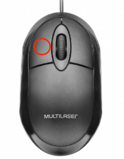
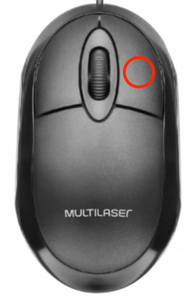
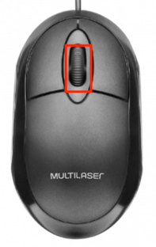
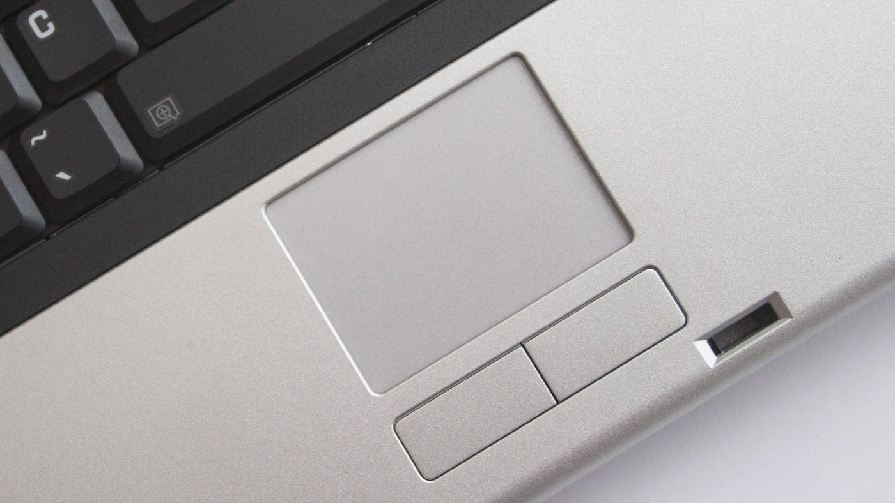

# Preciso de ajuda

Como podemos te ajudar?

Abaixo temos os assuntos que abordamos nesse menu.

Aqui você vai aprender ou relembrar pequenas dicas e informações de como usar o seu computador.

E lembre-se, sempre que precisar de ajuda, clique no botão azul ***Ajuda*** e encontre o que precisa saber.

## Conteúdo

<!-- TOC -->
* [Preciso de ajuda](#preciso-de-ajuda)
  * [Conteúdo](#contedo)
  * [O que faz o mouse?](#o-que-faz-o-mouse)
    * [Ponteiros do mouse](#ponteiros-do-mouse)
  * [O que faz o teclado?](#o-que-faz-o-teclado)
    * [Funções básicas do teclado](#funes-bsicas-do-teclado)
    * [Acentos](#acentos)
  * [Como usar os campos?](#como-usar-os-campos)
    * [Campos do tipo data](#campos-do-tipo-data)
      * [Importante:](#importante-)
    * [Campos do tipo lista ou seleção](#campos-do-tipo-lista-ou-seleo)
    * [Campos de texto](#campos-de-texto)
<!-- TOC -->

## O que faz o mouse?

O mouse é a setinha que utilizamos para apontar, como se fosse com o dedo o que queremos fazer no computador. Os mouses
geralmente tem
2 botões e uma rodinha.

| Botão    | Função                                                                                                                  | Exemplo                                                          |
|----------|-------------------------------------------------------------------------------------------------------------------------|------------------------------------------------------------------|
| Esquerdo | É o que faz uma ação, se clicar com o botão esquerdo do mouse em um botão o computador fará a ação que o botão informa. |    |
| Direito  | Quando clicado, geralmente mostra todas as opções de ações que o usuário pode ter.                                      |   |
| Rodinha  | Pode ser utilizada para descer ou subir a tela                                                                          |  |

Observações sobre o mouse:

1. Para rolar a tela, pode se usar também o gesto de arrastar na barra de rolagem, como no exemplo abaixo:

   Para arrastar, clique e segure no botão esquerdo e movimente o mouse.

2. Se você estiver em um notebook, deve usar o touchpad. Onde voce vai arrastar o dedo em cima para mover o mouse.
   

### Ponteiros do mouse

Em algumas situações o ponteiro do mouse pode mudar conforme o contexto do elemento que ele está passando em cima.

| Imagem                                                             | Contexto                                                                                     |
|--------------------------------------------------------------------|----------------------------------------------------------------------------------------------|
|  | O Cursor normal, visível maior parte do tempo.                                               |
|         | Indica que é um botão para obter ajuda.                                                      |
|          | Indica que ao clicar, vai executar uma função de um botão ou redirecionar para outra página. |
|  | Indica que o item não está disponível e que nenhuma ação acontecerá.                         |
|     | Indica que o campo onde está o mouse é uma entrada de textos.                                |

## O que faz o teclado?

O teclado é o responsável por escrever dentro do computador, ele tem muitas semelhanças com a máquina de escrever.

### Funções básicas do teclado

1. Apagar
2. Espaço
3. Maiusculo e minusculo / caixa baixa e caixa alta

Para escrever corretamente precisamos alterar entre letras minusculas e maiúsculas.
Existem duas formas para fazer esta alteração.

| Botão            | Como funciona                                                                                                                                                                                         |
|------------------|-------------------------------------------------------------------------------------------------------------------------------------------------------------------------------------------------------|
| Shift            | Enquanto está pressionado altera todas letras do alfabeto de minúscula para maiúscula e vice-versa. Pressione Shift junto com outra tecla para digitar o símbolo mostrado na parte superior da chave. |
| Caps lock / Fixa | Funciona como um interruptor. Um clique deixa todas letras maiúscula e com outro clique deixa todas minúsculas e vice-versa. O teclado pode ter uma luz que indica se Caps Lock está ativada.         |
| Tab / Aba        | Pressione Tab para mover o cursor vários espaços para a frente. Você também pode pressionar Tab para mover-se para a próxima caixa de texto em um formulário.                                         |
| Barra de espaço  | Pressione a barra de espaços para digitar um espaço para a frente.                                                                                                                                    |
| Backspace        | Pressione Backspace para excluir o caractere anterior ao cursor ou o texto selecionado.                                                                                                               |

### Acentos

Para digitar acentos, procure o botão que tem seu acento no teclado. São duas opções o acento primário e o secundário.

Para colocar o acento em uma letra, clique primeiramente no botão do acento e depois na letra em que deseja coloca-la.

Caso tenha dúvidas, assista o video abaixo.

!!! video aqui

## Como usar os campos?

### Campos do tipo data

Os campos do tipo data tem dia, mes e ano com números.

- **dd** representa os dias do mês, de 1 ao 31.
- **mm** representa os meses do ano, de 1 ao 12.
- **aaaa** representa o ano com 4 digitos.

Ao clicar no campo, as letras **dd** ficam azuladas, nesse momento se você digitar um numero, irá alterar o valor do dia.
para dias menores que 10, utilize o 0, ficando 01 para o primeiro dia, 02 para o segundo e assim em diante.

Da mesma forma que para o dia (dd), ao clicar no mm ou aaaa, as letras ficarão azuladas demonstrano que a edição é possivel. Então basta digitar e substituir.

Também é possível selecionar a data navegando pelo icone do calendário.
1. Clique no icone do calendario.
2. Clique no mes e ano atual. Ex: dezembro de 2022
3. Suba pela lista com a rodinha do mouse até o ano que deseja.
4. Clique no ano que deseja.
5. Clique no mês que deseja.
6. Clique no dia que deseja.

Certo, você conseguiu.

Dica: preencha o campo digitando e selecionando com o mouse. É bem mais fácil.

#### Importante:
> Para datas, a tecla Backspace do teclado apaga todo valor inserido de maneira errada, ficando apenas as letras do campo.
>
> Quando precisar corrigir, selecione o que deseja alterar clicando com o mouse, clique em Backspace e digite novamente o valor que deseja.

### Campos do tipo lista ou seleção

Os campos de lista e seleção são opções que o site dá para você escolher.
Na Melhor Rede, utilizamos esse tipo de capo quando você informa seu estado ou cidade.

Como usar?
1. Clique no campo, suba ou desça com a rodinha do mouse ou as setinhas do teclado para cima ou para baixo.
2. Escolha clicando com o mouse (botão esquerdo).

Dica: Para procurar coisas nas listas, após clicar você pode digitar parte do qnome que procura e o seletor vai diretamente para a opção, caso ela exista.

### Campos de texto

É o tipo de campo mais usado na Melhor Rede.
E também o mais simples.

Ao clicar em cima, o cursor vai começar a piscar. E já pode ser digitada a informação.

Dica: Para saber se o campo é do tipo texto, passe o mouse em cima e verifique se o mouse mudou o ícone para tipo cursor como mostrado na seção **Ponteiros do mouse**
